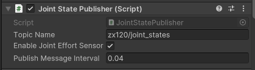
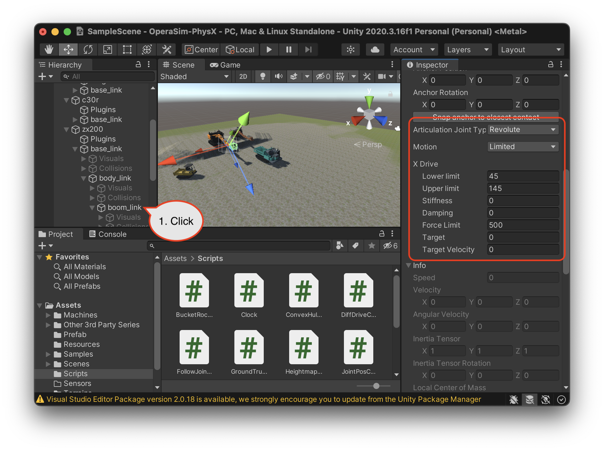
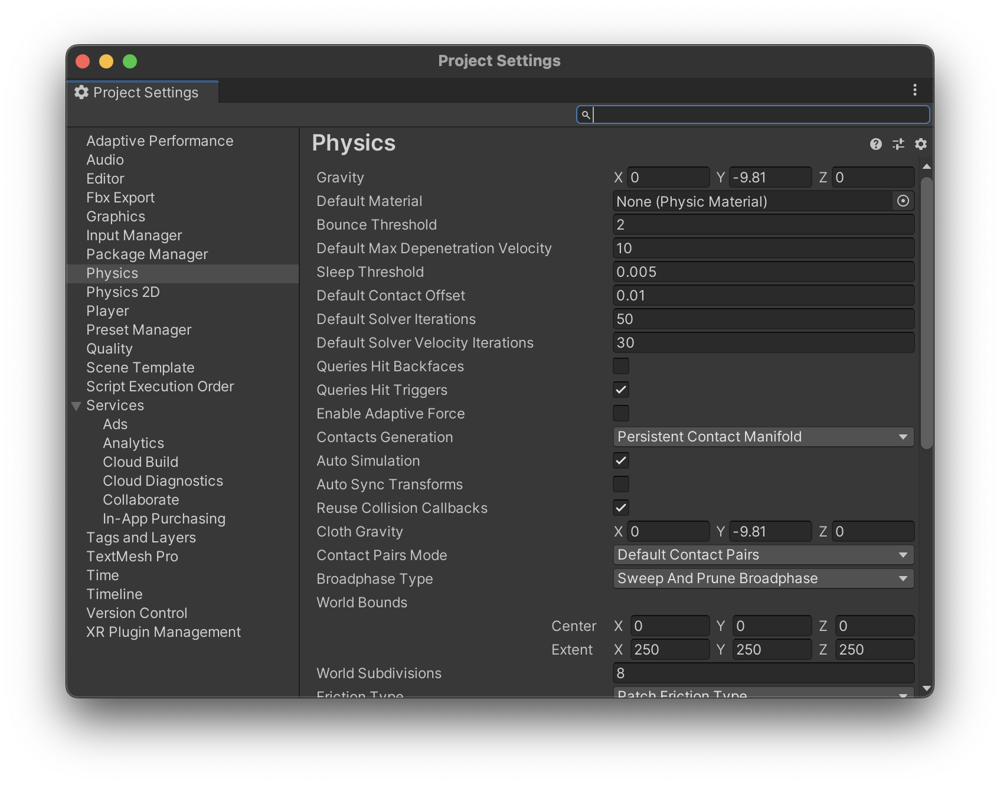
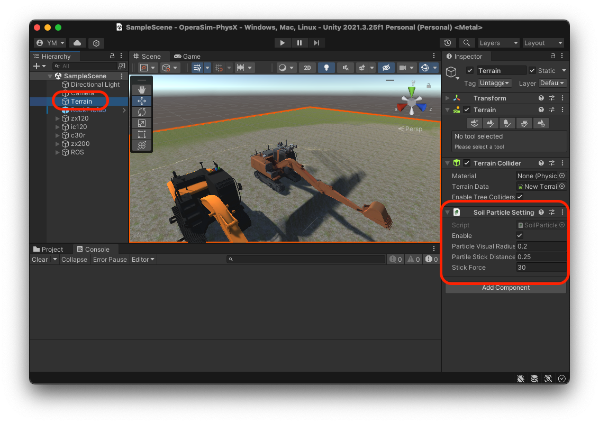
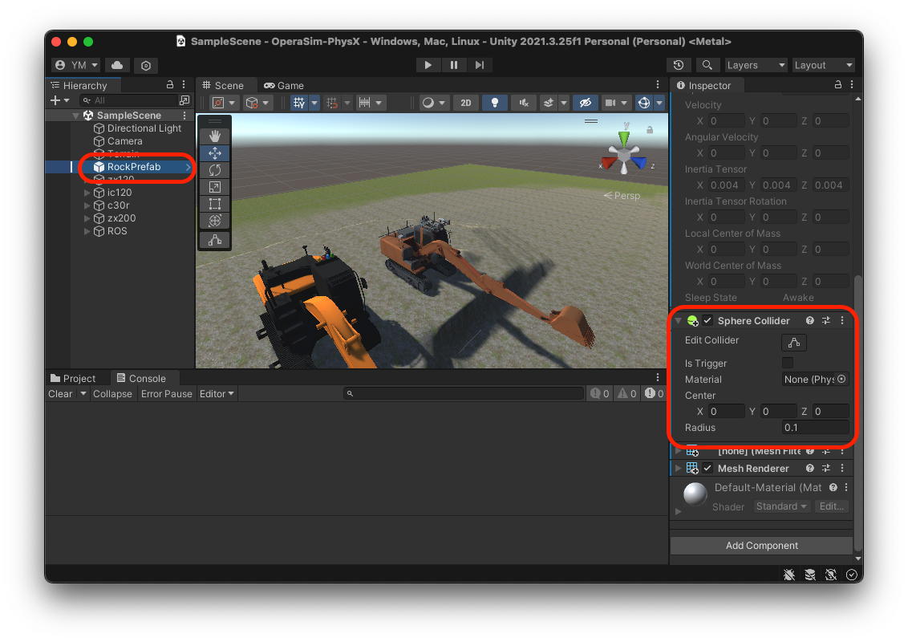

# OperaSim-PhysX
Simulator on Unity + PhysX communicating with ROS

## 概説
- 本シミュレータは自律施工技術開発基盤OPERA（Open Platform for Earth work with Robotics and Autonomy）の一部であり、どなたでも利用可能です
- シミュレータプラットフォームに[Unity](https://unity.com/)、物理エンジンに[Nvidia PhysX](https://www.nvidia.com/ja-jp/drivers/physx/physx-9-19-0218-driver/)を利用しています
- Unityを利用するため、利用者が所属する組織に応じたUnityのライセンスが必要です。詳細は[Unityの公式サイト](https://store.unity.com/ja)をご確認の上、利用登録をしてください。


## インストール方法
### 1. Unity(ver:2022.3.4f1)のインストール

使用しているPCのOSに応じて以下の通りUnityHubをインストールする


- windows 又は Macの場合: [https://unity3d.com/jp/get-unity/download](https://unity3d.com/jp/get-unity/download)
- Linuxの場合(Linux版は動作確認していない):[https://unity3d.com/get-unity/download](https://unity3d.com/get-unity/download)

### 2. Projectファイルの開き方とUnity Editorのダウンロード
- UnityHubを起動し、画面右上の「追加」から`OperaSim_PhysX`(Githubから自身のPCにダウンロードしたもの)選択し、クリックする（初回起動時には数分程度の時間がかかります）。クリックした際に指定のUnity Editorを選択しダウンロードする。

### 3. Sceneファイルの選択
- デモ用のサンプルSceneファイルが`Asset/Scenes/SampleScene.unity`にあるので、これを開く.  

### 4. ROS-TCP-Connectorの設定
- UnityEditorの上部ツールバーからRobotics > ROS Settingを開き"ROS IP Address", "ROS Port"のところにROS側のIPアドレスおよびポート番号(defaultは10000)を入力する
- もしROS2を利用する場合は"Protocol"のところを"ROS1"->"ROS2"へ変更する


### 5. ROSとの連携方法

- 【初回のみ】ROS側で[ROS-TCP-Endpoint](https://github.com/Unity-Technologies/ROS-TCP-Endpoint)パッケージをcloneし、buildとセットアップを行う。
ROS 1 の場合
  ```bash
  $ cd (rosワークスペース)/src
  $ git clone https://github.com/Unity-Technologies/ROS-TCP-Endpoint.git
  $ cd ./ROS-TCP-Endpoint/
  $ sudo chmod +x setup.py
  $ ./setup.py
  $ catkin build ros_tcp_endpoint
  $ source ../../devel/setup.bash
  ```
ROS 2 の場合
  ```bash
  $ cd (ros2ワークスペース)/src
  $ git clone -b main-ros2 https://github.com/Unity-Technologies/ROS-TCP-Endpoint.git
  $ cd ./ROS-TCP-Endpoint/
  $ sudo chmod +x setup.py
  $ ./setup.py
  $ cd ../../
  $ colcon build --packages-select ros_tcp_endpoint
  $ . install/setup.bash
  ```
- ROS側でendpoint.launchを実行する
  ```bash
  $ roslaunch ros_tcp_endpoint endpoint.launch
  ```
- Unity Editor上部の実行ボタンをクリックする


- ROS側で、対応する建機のunity用launch ファイルを起動する
  - 油圧ショベル
  ```bash
  $ roslaunch zx120_unity zx120_standby.launch
  ```
  - クローラダンプ
  ```bash
  $ roslaunch ic120_unity ic120_standby.launch
  ```
  <!--
  - 油圧ショベルとクローラダンプの両方
  ```bash
  $ roslaunch zx120_ic120_standby.launch
  ```
  -->
 #### ROSと連携時の送受信データ
- Cmd (ROS -> Unity) 

| データの内容 | トピック名 | トピック型 | 物理量 | 単位 | 備考 |
| ----  |  ---- | ---- | ---- | ---- | ---- |
| 建機の移動体部に対する対地速度指令値 | /(建機のns)/tracks/cmd_vel | geometry_msgs/Twist | 速度 | [m/s],[rad/s] |  |
| ダンプトラックの荷台の傾斜角指令値 | /(建機のns)/vessel/cmd | std_msgs/Float64 | 角度 | [rad] |  |
| 建機のスイング軸の角度指令値 | /(建機のns)/swing/cmd | std_msgs/Float64 | 角度 | [rad] |  |
| 建機のブーム軸の角度指令値 | /(建機のns)/boom/cmd | std_msgs/Float64 | 角度 | [rad] |  |
| 建機のアーム軸の角度指令値 | /(建機のns)/arm/cmd | std_msgs/Float64 | 角度 | [rad] |  |
| 建機のバケット軸の角度指令値 | /(建機のns)/bucket/cmd | std_msgs/Float64 | 角度 | [rad] |  |
   
- Res（Unity -> ROS）
     
| データの内容 | トピック名 | トピック型 | 物理量 | 単位 | 備考 |
| ----  |  ---- | ---- | ---- | ---- | ---- |
| 建機のベースリンクの座標 | /(建機のns)  /base_link/pose | geometry_msgs/PoseStamped | 位置・姿勢 | 位置:[m]  姿勢:[-] | Unity内のworld座標系に対する座標の真値 |
| 建機のオドメトリ計算結果 | /(建機のns)  /odom | nav_msgs/Odometry | オドメトリ | 位置:[m]  姿勢:[-] | 初期位置を原点として算出している |
| 建機の関節角度・角速度 | /(建機のns)  /joint_states | sensor_msgs/JointState | 角度・角速度 | 角度:[rad]  角速度:[rad/s] | effortについては次節を参照 |

### 関節トルクセンサの有効化

各ゲームオブジェクトに設定された`Joint State Publisher`スクリプトの`Enable Joint Effort Sensor`をチェックすることで、joint_statesトピックからeffort値を出力させることができます。



> **Note**
> 関節トルクセンサは実機では利用できないことが多いのでご注意ください。

## パラメータのチューニング方法

### 関節制御パラメータのチューニング

各関節の制御パラメータは、ゲームオブジェクトのXDriveパラメータを変更することで可能です。



| プロパティ名 | 説明 |
| ----  |  ---- |
| Lower Limit | 関節可動角の下限（単位はdegree）。可動角制限を有効にするには、Motionプロパティを「Limited」に設定してください |
| Upper Limit | 関節可動角の上限（単位はdegree）。可動角制限を有効にするには、Motionプロパティを「Limited」に設定してください |
| Stiffness | 関節の剛性係数。係数の意味は下の式を参照。0の場合はデフォルト値20000を使用します |
| Damping | 関節の減衰係数。係数の意味は下の式を参照。0の場合はデフォルト値10000を使用します |
| Force Limit | 制御中に加えられるトルクの最大値（単位はnewton）。0の場合はデフォルト値10000を使用します |

Stiffness（剛性）とDamping（減衰）の各係数は、下の式に用いられます。

加えられるトルク = 剛性係数 * (駆動位置 - ターゲット位置) - 減衰係数 * (駆動速度 - ターゲット速度)

上記、各パラメータの詳しい説明は、Unityの公式マニュアルも参照ください。

https://docs.unity3d.com/ja/2023.2/Manual/class-ArticulationBody.html#joint-drive-properties

### 関節制御が振動的になった際のシミュレーションパラメータのチューニング

長いリンクのある多関節の重機をシミュレーションする際に、関節制御が振動的になることがあります。
この症状は、以下の調整を行うことで軽減できます。

メニューから `Edit > Project Settings...` を選択し `Physics` 項目を選択します。



`Default Solver Iterations` プロパティの数値を大きな値に変更してください。

### 粒子シミュレーションの挙動の調整

土砂の粒子シミュレーションのパラメータは、TerrainゲームオブジェクトのSoil Particle Settingで変更できます。



| プロパティ名 | 説明 |
| ----  |  ---- |
| Enable | 土砂の粒子シミュレーションをオフにしたい時には、このチェックボックスのチェックを外してください。 |
| Particle Visual Radius | 粒子の見た目上の半径を設定します。粒子同士が干渉する半径を設定するには、下のRockPrefabの設定も合わせて調整してください。 |
| Particle Stick Distance | 近くの粒子との間に引力を働かせることで、土砂の粘性を再現できます。引力を発生させる範囲を設定します。 |
| Stick Force | 近くの粒子との間に発生させる引力の強さを設定します。 |

粒子が周囲の粒子と干渉する半径を調整するには、RockPrefabのSphere ColliderのRadius値を変更してください。


